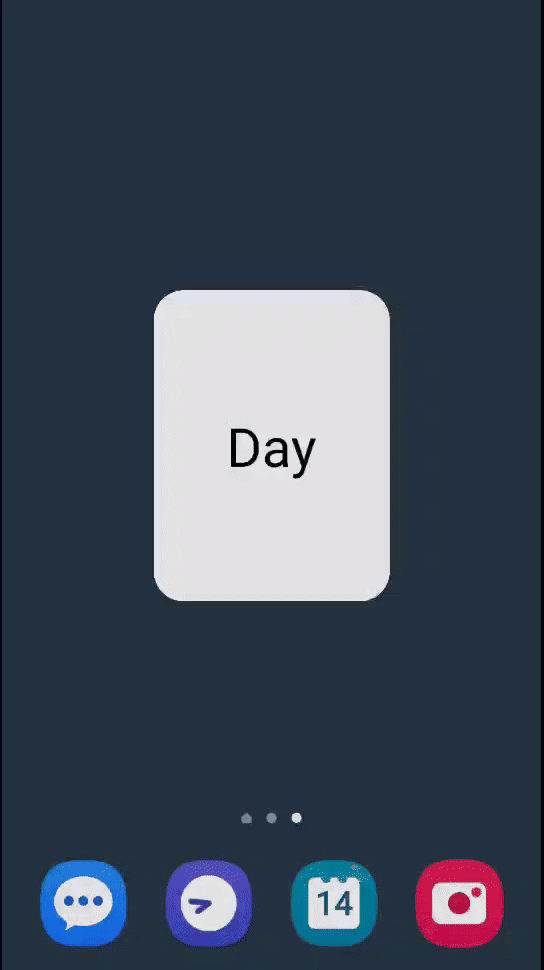

# Night Widget

A brief example of using a `Worker` with a content URI trigger to try to get
notified of night mode changes in an App Widget.

**NB**: If you're loading these images from resources, you don't need this.
Simply put the night mode images in the relevant `res/drawable*/` directories
with the `-night` suffix, and it will be handled automagically.

The specific `Settings` value that's monitored – `ui_night_mode` – is
undocumented and excluded from the SDK, so it probably won't work everywhere,
but it should just fail silently wherever it doesn't.

Some devices/manufacturers will have different and/or additional values that
change during a mode switch – e.g, https://stackoverflow.com/a/51909594 – so you
might be able to find other options for certain setups if `ui_night_mode`
doesn't work.

To look, you can set your own `ContentObserver` on `Settings.System.CONTENT_URI`
or `Settings.Secure.CONTENT_URI` to see what changes on a particular device. You
don't need to read the value from `Settings`, just need to know when it changes,
so this method shouldn't require any special permissions. You should still
account for possible `Exception`s if using this in production, however.

In any case, this approach should be viewed as kind of a bonus feature that's
nifty to have if it happens to function at runtime on a given device, but that
shouldn't really be expected to work. Have a fallback ready.

Lastly, do note that this combination of a `Worker` with an App Widget can be
finicky and fragile during development. Certain debug operations like "Apply
Changes…" can cause things to break completely, and you might have to
uninstall/reinstall quite often. Just a heads up.

 

## License

MIT License

Copyright (c) 2025 Mike M.

Permission is hereby granted, free of charge, to any person obtaining a copy
of this software and associated documentation files (the "Software"), to deal
in the Software without restriction, including without limitation the rights
to use, copy, modify, merge, publish, distribute, sublicense, and/or sell
copies of the Software, and to permit persons to whom the Software is
furnished to do so, subject to the following conditions:

The above copyright notice and this permission notice shall be included in all
copies or substantial portions of the Software.

THE SOFTWARE IS PROVIDED "AS IS", WITHOUT WARRANTY OF ANY KIND, EXPRESS OR
IMPLIED, INCLUDING BUT NOT LIMITED TO THE WARRANTIES OF MERCHANTABILITY,
FITNESS FOR A PARTICULAR PURPOSE AND NONINFRINGEMENT. IN NO EVENT SHALL THE
AUTHORS OR COPYRIGHT HOLDERS BE LIABLE FOR ANY CLAIM, DAMAGES OR OTHER
LIABILITY, WHETHER IN AN ACTION OF CONTRACT, TORT OR OTHERWISE, ARISING FROM,
OUT OF OR IN CONNECTION WITH THE SOFTWARE OR THE USE OR OTHER DEALINGS IN THE
SOFTWARE.